# Phase 2: Visual Analysis with Splunk SIEM

##  Objective
Use **Splunk** as a SIEM platform to collect, forward, and visualize security logs from a victim machine (Metasploitable3) or honeypot system.

---

##  Environment Setup

| Machine         | Role            | IP Address       |
|----------------|------------------|------------------|
| Kali Linux     | Attacker         | 192.168.64.2     |
| Metasploitable3| Victim           | 192.168.64.3     |
| Local Machine  | SIEM             | 192.168.129.1    |

---

## Part 1: Splunk SIEM Setup (Server & Web Interface)

### Step 1: Install Splunk Server (SIEM)
```bash
wget -O splunk-9.3.2.deb https://download.splunk.com/products/splunk/releases/9.3.2/linux/splunk-9.3.2-d8bb32809498-linux-2.6-amd64.deb
sudo dpkg -i splunk-9.3.2.deb
sudo apt --fix-broken install
sudo /opt/splunk/bin/splunk start --accept-license
```

### Step 2: Access Splunk Interface
Navigate to `http://127.0.0.1:8000`  
Login with:
- Username: `admin`
- Password: *(Was set during first boot)*

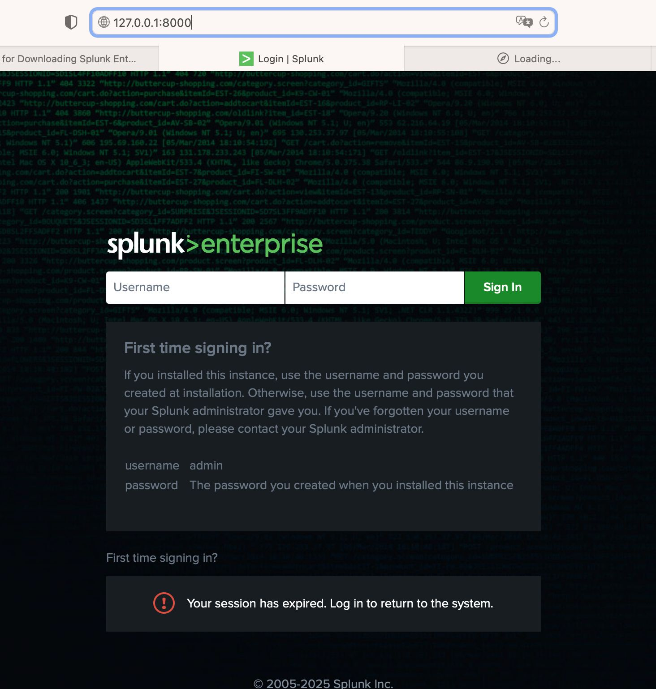

---

##  Part 2: Extract Log Files (Victim & Attacker)

### Victim's Log File:
### Step 1: Read and Copy Log File

Read the log file `auth.log` on the **victim machine** (Metasploitable3), and copy it to directory `/home/vagrant/`
```bash
sudo cat /var/log/auth.log
sudo cp /var/log/auth.log /home/vagrant/
```

The ownership of the file was changed so **Kali Linux** could copy it successfully
```bash
sudo chown vagrant:vagrant /home/vagrant/auth.log
```


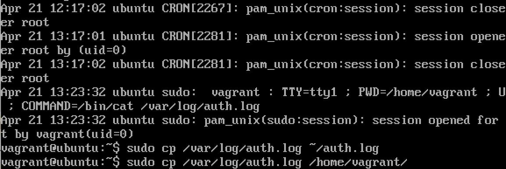

### Step 2: Transfer Log File
Copy the log file `auth.log` on **Kali Linux**, and send it to **local machine** through email

```bash
scp vagrant@192.168.64.3:/home/vagrant/auth.log ~/Desktop/
```

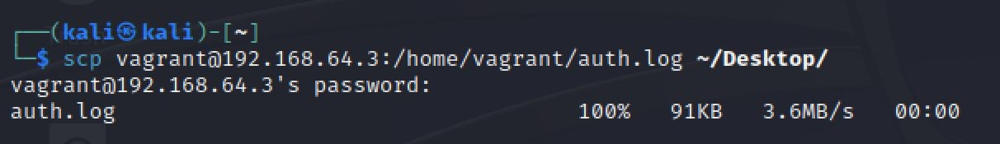

### Attacker's Log File:
### Step 3: Copy and Transfer Log File

Copy `valid_credentials` to log file `attacker.log`, and send it to **local machine** through email

```bash
cp ~/valid_credintials.txt ~/Desktop/attacker.log
```

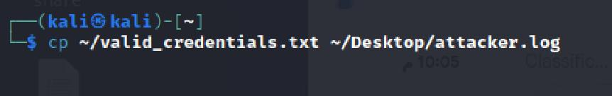

---

##  Part 3: Log Upload and Visualization in Splunk

### Victim part:
### Step 1: Uploading Log File
1. In Splunk's webpage, click on `Add data`
2. Click on `Upload` to upload a file from the **local machine**
3. In the **Select Source** step, click on `Select File` and choose the log file `auth.log`
4. In the **Set Source Type** step, leave the source type as **default**
5. Cont. in the **Set Source Type** step, name and add description for the source type
6. In the **Input settings** step, configure the **Host** as **Constant value** and **Index** as **Default**
7. In the **Review** step, there is a summary for the configuration
8. In the **Done** step, click on `Start Searching` to start analyzing data

 Screenshots:

1. 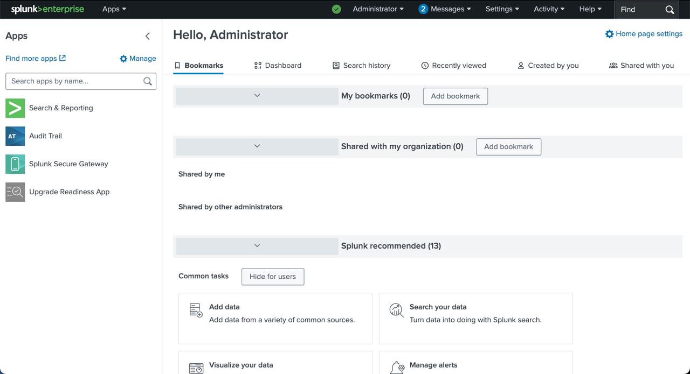
2. 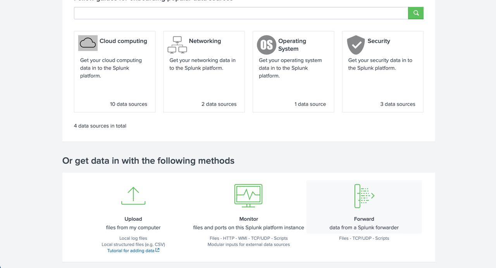
3. 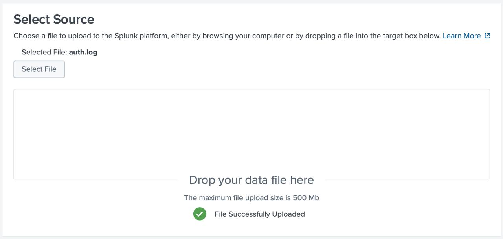
4. 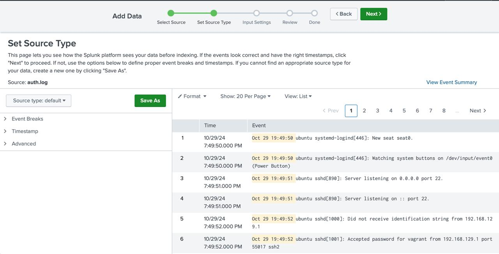
5. 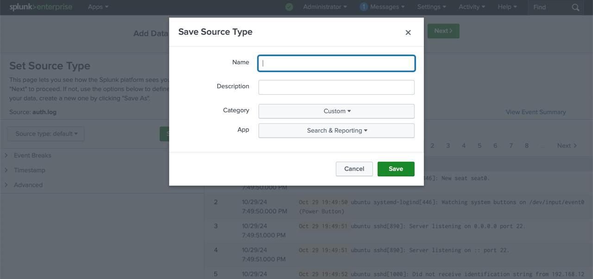
6. 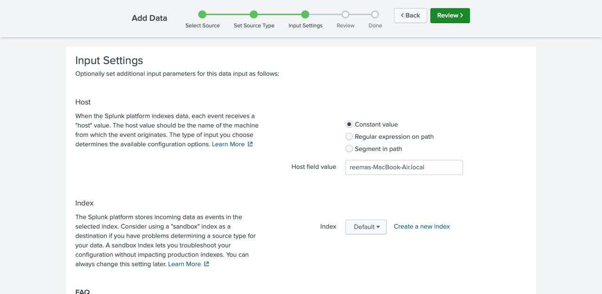
7. 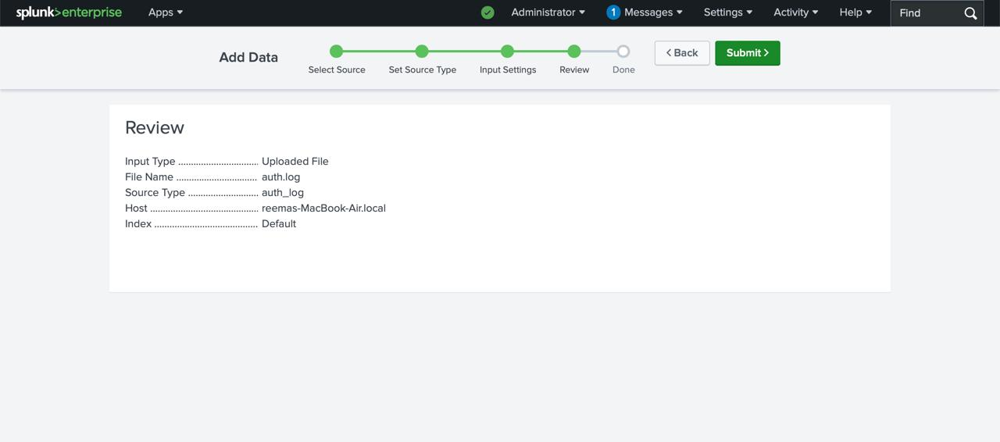
8. 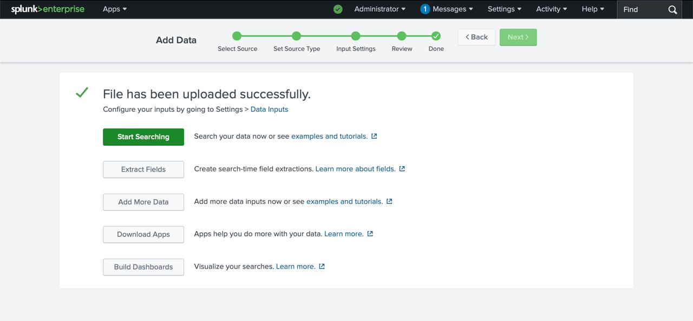

### Step 2: Queries & Dashboard
#### Failed SSH Login Attempts (Hourly)
```bash
index=main sourcetype="auth_log" "Failed password"
| timechart span=1h count
```
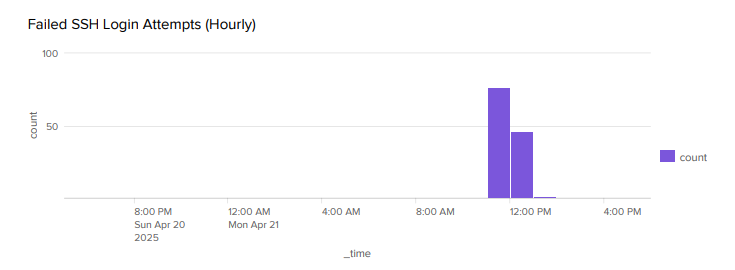

#### Accepted SSH Login Attempts (Hourly)
```bash
index=main sourcetype="auth_log" "Accepted password"
| timechart span=1h count
```
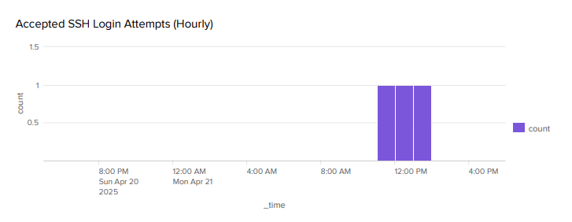

#### Top IPs with Successful Logins
```bash
index=main sourcetype="auth_log" "Accepted password"
| rex 'from (?<ip>\d+\.\d+\.\d+\.\d+)'
| stats count by ip
| sort - count
```
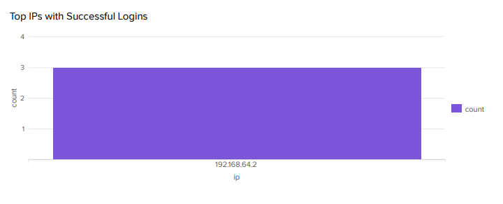

### Attacker part:
### Step 3: Uploading Log File
1. In Splunk's webpage, click on `Add data`
2. Click on `Upload` to upload a file from the **local machine**
3. In the **Select Source** step, click on `Select File` and choose the log file `attacker.log`
4. In the **Set Source Type** step, leave the source type as **default**
5. In the **Input settings** step, configure the **Host** as **Constant value** and **Index** as **Default**
6. In the **Review** step, there is a summary for the configuration

 Screenshots:

1. 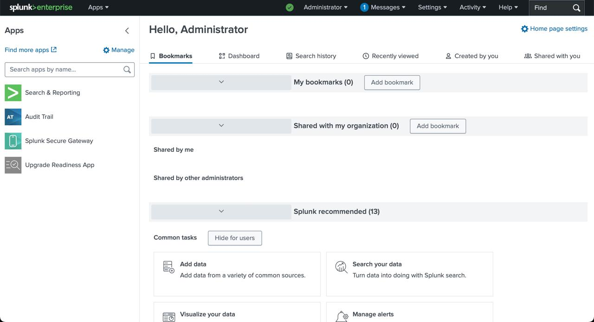
2. 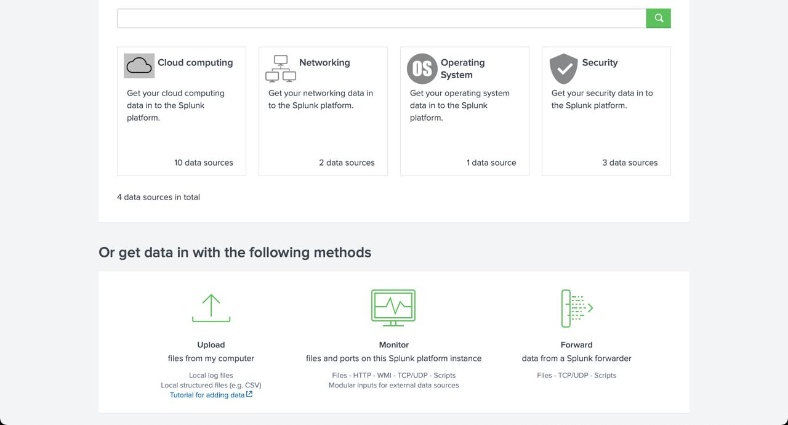
3. 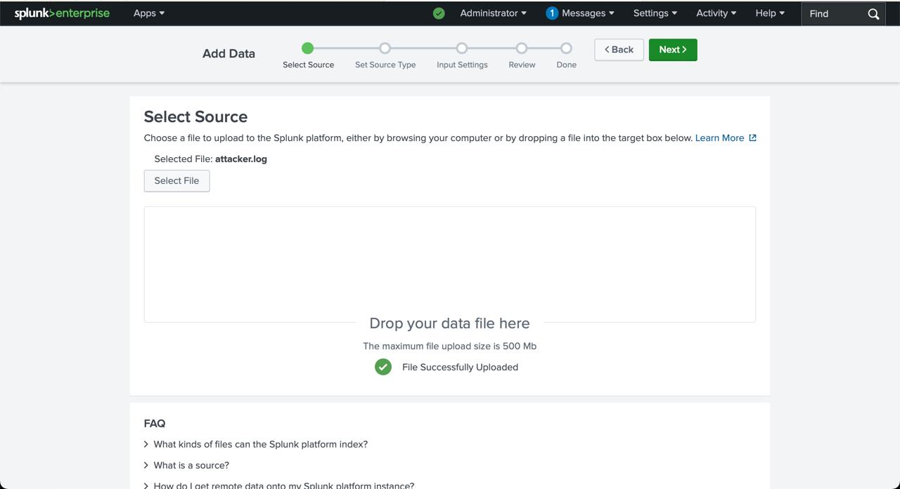
4. 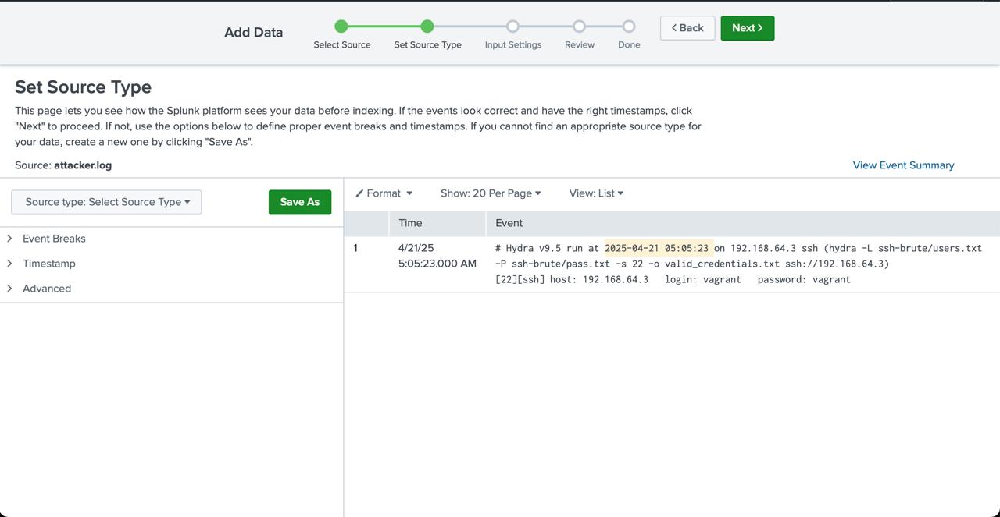
5. 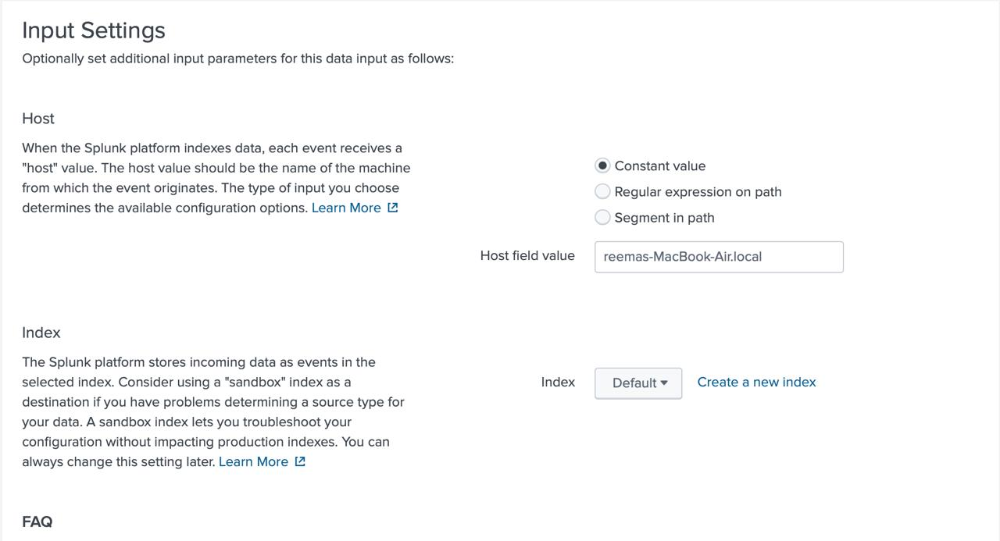
6. 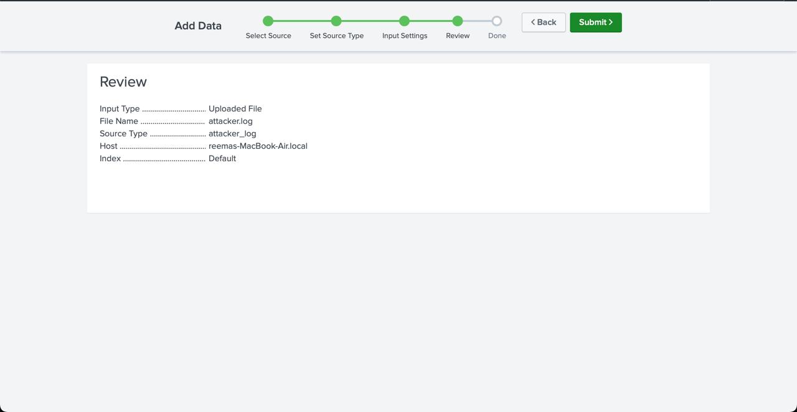

### Step 4: Queries & Dashboard

---

##  Part 4: Queries & Dashboard

###  Example Queries

#### 1. Failed Password Attempts Over Time
```spl
index=main sourcetype="auth_log" "Failed password"
| timechart span=1h count
```


---

#### 2. Accepted Passwords by IP
```spl
index=main sourcetype="auth_log" "Accepted password"
| rex "from (?<ip>\d+\.\d+\.\d+\.\d+)"
| stats count by ip
| sort -count
```


---

### Save Panel to Dashboard


---

##  Troubleshooting & Common Errors

### Log File Not Found
```bash
cat /var/log/auth.log
# No such file or directory
```


---

##  What to Monitor in Splunk

| Item                 | Reason                              |
|----------------------|-------------------------------------|
| `auth.log`           | Login attempts, brute-force signs   |
| `syslog`             | System-wide alerts, reboots         |
| `messages`           | Kernel messages, error reporting    |
| `secure`             | Authentication-related events       |

---

##  Summary

This phase demonstrated:
- How to install and configure Splunk SIEM
- Use of a forwarder to collect logs
- Manual log upload and analysis
- Creating dashboards to detect intrusions


