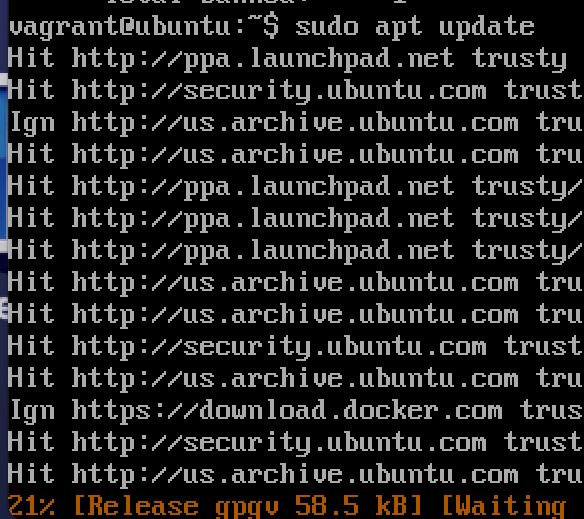
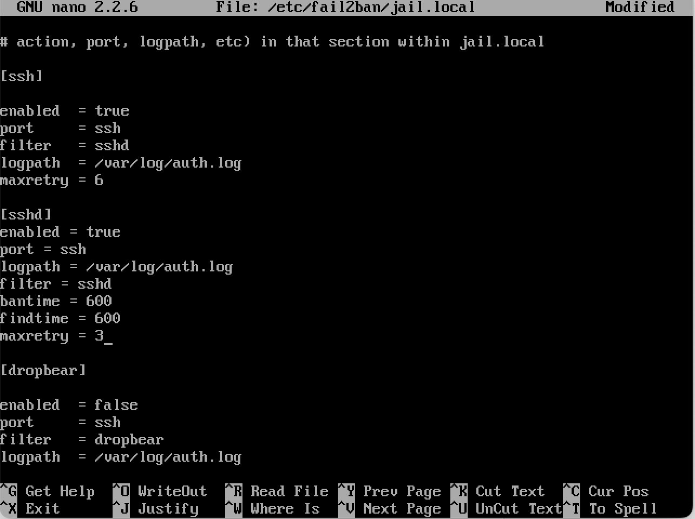
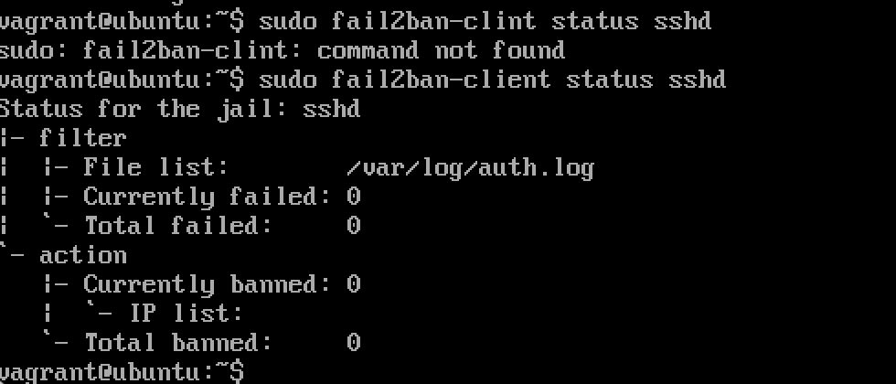
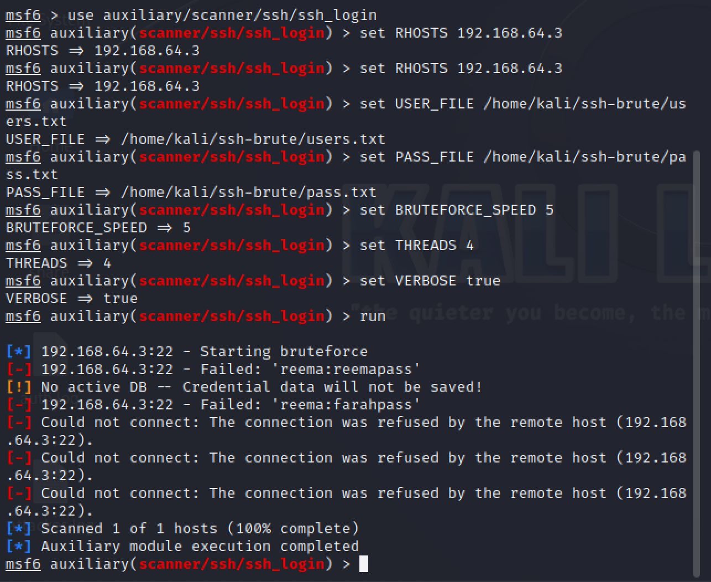
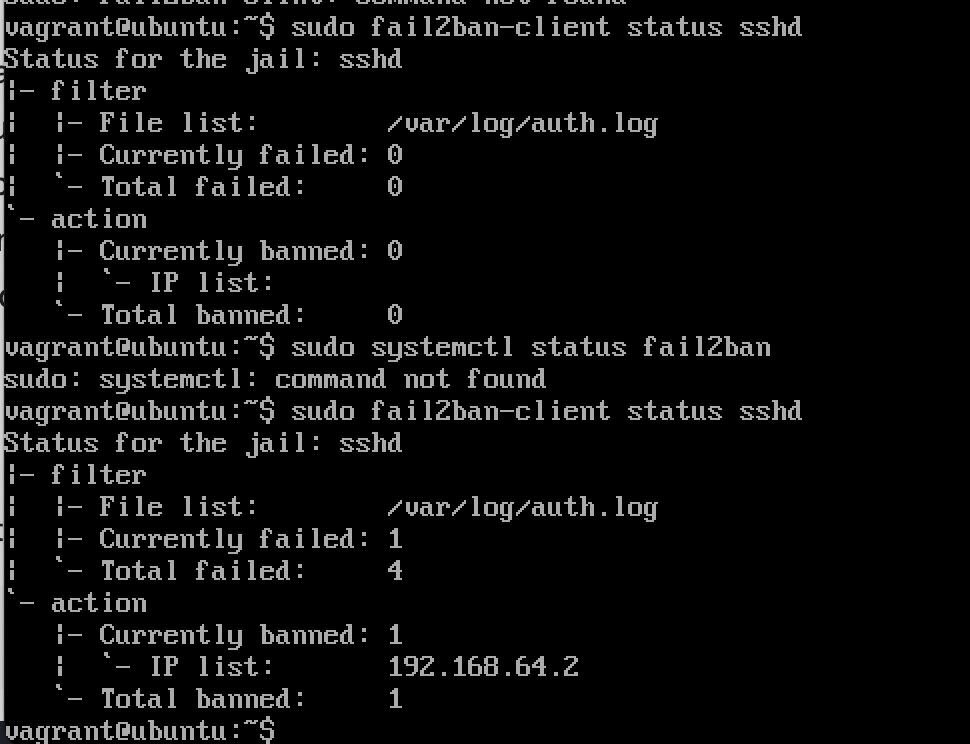

#  Phase 3: Defensive Strategy – SSH Protection with Fail2Ban

##  Objective
To secure the SSH service on the victim machine (Metasploitable3) by using **Fail2Ban** to block brute-force login attempts. The effectiveness of the defense is validated by re-running the attack from Phase 1 and showing the IP gets banned.

---

##  Defense Mechanism Used: **Fail2Ban**

Fail2Ban is a log-parsing tool that protects services like SSH from brute-force attacks by banning IPs with repeated failed login attempts.

---
##  Step-by-Step Defense Implementation

---

## Step 1: Install Fail2Ban

On the **victim machine** (Metasploitable3):

```bash
sudo apt update
sudo apt install fail2ban -y
```
---



## Step 2: Backup and Edit Jail Config
Make a backup of the default config and open the jail.local file:
```bash
sudo cp /etc/fail2ban/jail.conf /etc/fail2ban/jail.local
sudo nano /etc/fail2ban/jail.local
```


---
## Step 3: Configure [sshd] Section
Add the following section:
```bash
[sshd]
enabled = true
port = ssh
filter = sshd
logpath = /var/log/auth.log
maxretry = 3
bantime = 600
findtime = 600
```
This means if someone fails to log in 6 times within 10 minutes, they get banned for 10 minutes.
#### Breif Explanation:

enabled = true: Turns on SSH monitoring.

port = ssh: Monitors default SSH port (22).

filter = sshd: Uses the SSH filter Fail2Ban provides.

logpath = /var/log/auth.log: Auth log location for login attempts.

maxretry = 3: Ban IP after 3 failed login attempts.

bantime = 600: Ban duration (10 minutes).

findtime = 600: Time window for counting failed attempts.



---
## Step 4: Restart Fail2Ban
Restart the service to apply the new configuration:
```bash
sudo service fail2ban restart
```


---
## Step 5: Verify That the SSH Jail is Active
Check that the SSH jail is working and monitoring login attempts:
```bash
sudo fail2ban-client status sshd
```


---
## Step 6: Re-run the SSH Attack from the Attacker (Kali)
On the Kali attacker machine, simulate brute-force login attempts (as done in Task 1.1):



## Step 7: Confirm IP Ban (Proof of Defense)
Back on the victim machine, confirm the defense was successful by checking the jail again:
```bash
sudo fail2ban-client status sshd
```


---

## Conclusion

By implementing **Fail2Ban** on the victim machine, we successfully protected the SSH service from brute-force attacks. The attacker’s IP address was automatically detected and banned after repeated failed login attempts.

This proves that **Fail2Ban** is an effective, lightweight, and easy-to-configure defensive tool for Linux systems. It improves overall security by dynamically responding to suspicious behavior, helping to prevent unauthorized access and system compromise.

The re-executed attack from Phase 1 failed after enabling Fail2Ban, confirming the success of the defensive strategy.


